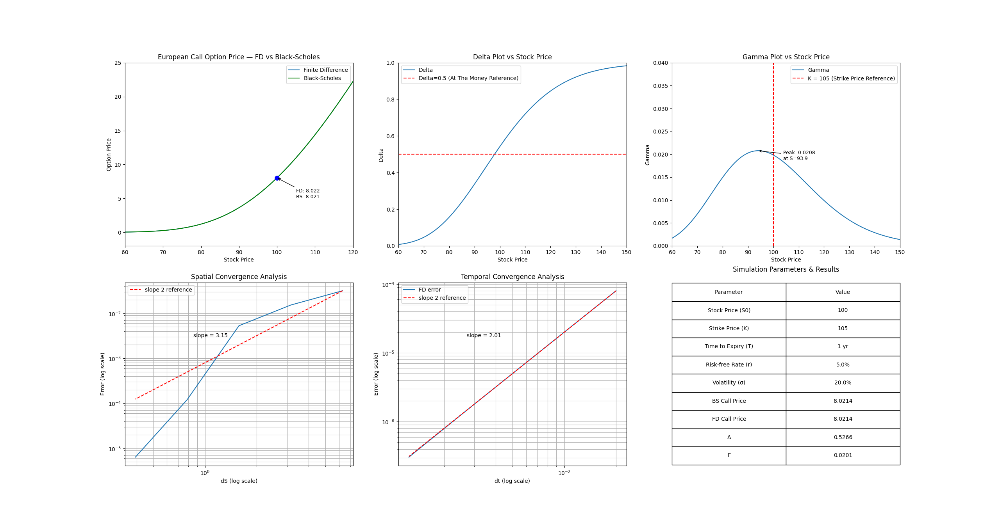

Black Scholes Equation Simulation and Exploration

This project consists of an implementation of the Black Scholes PDE, its closed form solution, and an exploration of the finite difference method of solving the equation numerically. 

Motivation and Background

This project exists in order to explore the Black Scholes equation (BSE). The BSE is the differential equation at the heart of modern quantitative finance, modeled after the heat equation. BSE determines the price of a stock option based on the parameters of the base stock price, strike price, time to expiry, interest rate, and volatility. The statement of the BSE is as follows

$$ \frac{\partial V}{\partial t} + \frac{1}{2} \sigma^2 S^2 \frac{\partial^2 V}{\partial S^2} + rS\frac{\partial V}{\partial S} - rV = 0 $$

Where S is the stock price, V is the options price, which satisfies the payoff condition at expiry, $\sigma$ is the volatility, T is the time to expiry and r is the interest rate. 

BSE has a closed form solution, however it relies on multiple assumptions, namely that the portfolio is hedged continuously, that the options in question are European options rather than American, and that volatility is constant. The ideal closed form solution is given as:

$$ C = S N(d_1) - Ke^{-rT} N(d_2), \qquad P = Ke^{-rT} N(-d_2) - S N(-d_1) $$

Where:

$$ d_1 = \frac{\ln(S/K) + (r + \frac{1}{2}\sigma^2)T}{\sigma \sqrt{T}} $$
$$ d_2 = d_1 - \sigma \sqrt{T} $$

And N is the cumulative normal distribution function. 

In practice real markets show a volatility smile, causing the assumption of constant volatility to break down and necessitate the usage of numerical methods to determine options pricing. 

The numerical method employed in this code is the finite difference, or Crank-Nicolson discretization, method. In these methods we consider a 2-D grid with the stock price S on one axis and time t on the other axis, running from today at t = 0 to expiry at t = T. We then impose the following boundary conditions

$$ V(S, T) = max(S-K, 0), \quad V(0, t) = 0, \quad S = S_{max} \implies V = S_{max} - Ke^{-r(T-t)} $$

Meaning that 

1. if the stock price is below the strike price at expiry, the option is worth 0, otherwise it is worth the difference between the current price and the strike price. 
2. If the stock price is worth 0, then the option is also worth 0. 
3. When the stock price reaches its maximum, the option is worth the same amount minus a time-dependent exponentially decaying factor. 

From there we replace the partial derivatives with finite differences after discretizing the grid with steps $\Delta S$ and $\Delta t$. 

$$ \frac{\partial V}{\partial t} \approx \frac{V_{i, j+1} - V_{i, j}}{\Delta t} $$
$$ \frac{\partial V}{\partial S} \approx \frac{V_{i+1, j} - V_{i-1, j}}{2 \Delta S} $$
$$ \frac{\partial^2 V}{\partial S^2} \approx \frac{V_{i+1, j} - 2V_{i, j} + V_{i-1, j}}{ \Delta S^2} $$

This reduces the problem to a tridiagonal linear system of the form $Av^j = Bv^{j+1}$ where A and B are tridiagonal matrices and $v^{j+1}$ is the known solution at the previous time step. These matrices are composed of 3 vectors, $\alpha, \beta, \gamma$ that are placed along the central three diagonals. 

$$ \alpha_i = \frac{1}{4} \Delta t (\sigma^2 i^2 - ri) $$
$$ \beta_i = -\frac{1}{2}\Delta t (\sigma^2 i^2 +r) $$
$$ \gamma_i = \frac{1}{4}\Delta t (\sigma^2  i^2 + ri) $$

The matrices A and B are then built using these vectors as follows

| Matrix | Lower diag | Main diag | Upper diag |
|--------|-----------|-----------|-----------|
| A      | $-\alpha$ | $1-\beta$ | $-\gamma$ |
| B      | $\alpha$  | $1+\beta$ | $\gamma$  |

We then can iterate this matrix equation given our boundary conditions to fill out the full options price matrix. We can then find the index on our stock price matrix corresponding to $S_0$, the initial stock price, and read off the value on the options price matrix at that index to get the options price. 

Following that there are a few more quantities of interest that we can find, namely the Greeks. The Greeks are in essence the derivatives of the options price with respect to various quantities. The two we compute here are Delta, the first derivative with respect to stock price, and Gamma, the second derivative with respect to stock price. Computing other Greeks, such as Theta, first derivative with respect to time, can be left for future additions, but at the time these are what have been done. 

The final component of this project at the time of writing is the convergence analysis. Numerical solutions will always include some degree of numerical error with respect to the "true" value. In this case we can compare the error by taking the difference between the numerical solution's options price against the closed form price since we are operating under the same assumptions. 

It is however important to know how the error changes as we increase the fidelity of the simulation, in this case as we make the grid finer. This can be done by scaling the number of grid steps, N and/or M for stock price and time respectively, while holding all other quantities constant, then checking the value against the ideal options price for the error in stock price S. For the temporal convergence we used a finer grid solution as the reference in order to isolate the temporal error from the dominant spatial error. 

Since Crank-Nicolson is second order accurate in both stock price and time, we expect the error to go as $ \text{error} \sim O(\Delta S^2)$ and $ \text{error} \sim O(\Delta t^2)$. 

Project Structure

Black Scholes/
├── black_scholes.py      # closed form pricer and put-call parity
├── finite_difference.py  # Crank-Nicolson PDE solver
├── greeks.py             # Delta and Gamma
├── visualize.py          # plots
└── main.py               # entry point

Results

When running the program we find the following:

The closed form solution and the Crank-Nicolson method both are in solid agreement on the options price. This tells us that our grid was sufficiently discretized in order to minimize errors and shows that the Crank-Nicolson method is valid for the ideal case of BSE. 
We see the correct behavior for Delta as the stock price increases, leveling off at high values as the options price and stock price begin to move dollar for dollar, as well as leveling off at low values as the stock becomes so out of the money that the option is practically worthless. 
For gamma we see that the peak is at 93.9 rather than at the strike price of K=105. 
This is expected of an option that is slightly out of the money and is inline with the theoretical prediction of $ S = Ke^{(-r+\frac{3}{2}\sigma^2 T)} \approx 93.9$
The spatial convergence shows a distinct kink at around the strike price, this is a known characteristic of Crank-Nicolson when applied to non-smooth initial conditions. The derivative being discontinuous at the strike is due to the behavior of the option shifting from being in and out of the money, disrupting the order of the convergence. This can be resolved via Rannacher smoothing, but that is left to a future extension. 
The temporal convergence behaves exactly as predicted, with a slope of 2.01, after isolating the spatial error from the computation. 
Finally we have a list of calculated and defined parameters, here we see the closed form and simulated option price agree to 4 decimals and the values for gamma and delta being within bounds of what is expected of a slightly out of the money option.

Key Findings

- the Crank-Nicolson and BSE price agree to 4 decimal places
- Second order temporal convergence is confirmed with second order spatial convergence showing an expected kink due to non-smooth payoff
- Greeks are consistent with analytical values

Dependencies and How to Run

pip install numpy scipy matplotlib
python main.py

Future Extensions

Future extensions to consider would be some of the following: Extending the analysis to American Options, introducing stochastic volatility to justify the Crank-Nicolson approach, or implement Rannacher smoothing to see the proper spatial convergence. 
